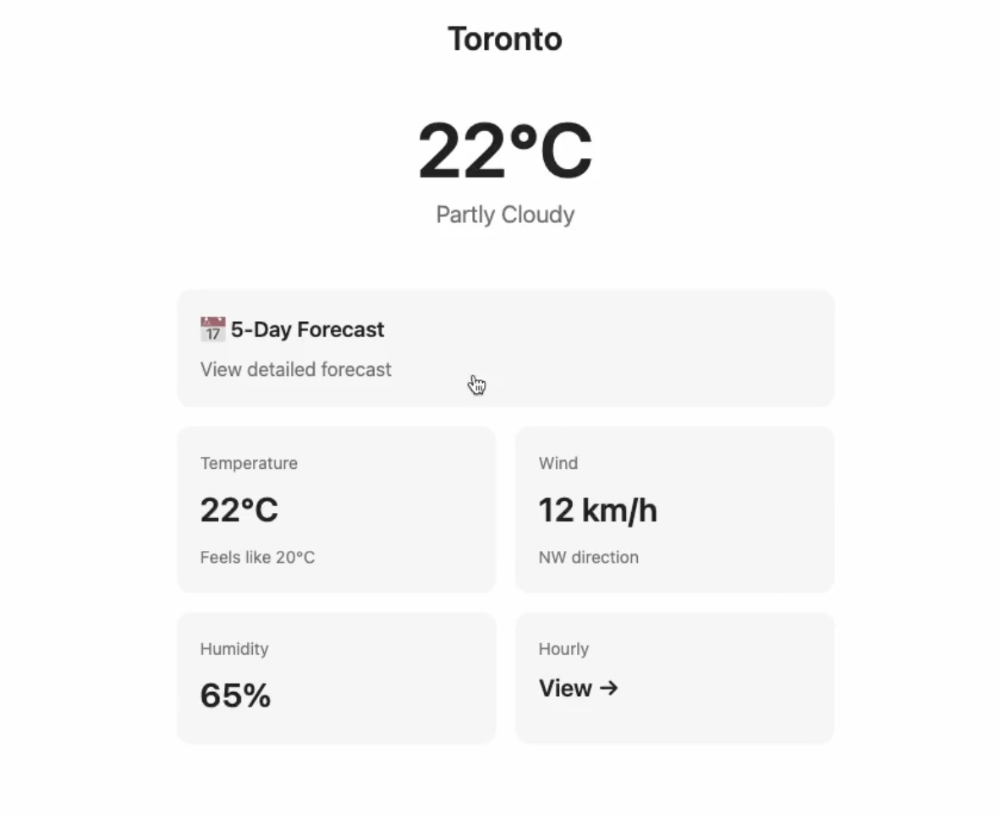

# How To Train Your Django 🐉
## (Project Toothless)

> **Early experimentation** with AI-generated user interfaces - an open-source exploration inspired by Anthropic's Claude Imagine.

## What is This?

Toothless is an **early-stage experiment** exploring what happens when you let AI dynamically generate *everything* - no predetermined pages, no fixed routes, just pure AI creativity responding to user interactions in real-time.

Inspired by [Claude Imagine](https://claude.ai/imagine/) (Anthropic's experimental feature for Max subscribers), this is an early attempt at demonstrating how Claude can generate complete, interactive web applications as you click through them. It's like having a UI designer, frontend developer, and content writer all working together instantly - powered by AI.

⚠️ **This is very early experimentation.** Expect rough edges, inconsistencies, and surprises. It's a learning project exploring the boundaries of AI-generated UIs.

## Demo

[](https://youtu.be/g4y4r2LhvVE)

*Watch Claude generate complete web pages in real-time as you navigate through the app*

## How It Works

1. **Start Simple** - Enter a city name to see weather information
2. **Click Anywhere** - Every element is generated with navigation context
3. **AI Decides Everything** - Claude analyzes what you clicked and generates the next page
4. **Infinite Exploration** - No predetermined paths, just endless AI-generated possibilities

### The Magic Behind It

- **Django + HTMX** - Server-side rendering with seamless navigation
- **Claude Agent SDK** - Claude Sonnet 4.5 generates HTML in real-time
- **Rich Context** - Each click passes navigation context (where you're from, where you're going)
- **Consistent Design** - System prompt ensures Airbnb-style minimalism throughout

Every button, card, and section tells Claude exactly what to generate next through `hx-vals` metadata. It's a self-documenting, self-generating application.

## Tech Stack

- **Django 5.2** - Python web framework
- **HTMX 2.0** - Dynamic HTML without JavaScript complexity
- **Claude Agent SDK** - Anthropic's Python SDK for Claude Sonnet 4.5
- **Python 3.13** - Modern Python with pipenv

## Quick Start

### Prerequisites

- Python 3.13+
- Anthropic API key ([get one here](https://console.anthropic.com/))

### Installation

```bash
# Clone the repository
git clone <your-repo-url>
cd toothless

# Install dependencies
pipenv install

# Create .env file
echo "ANTHROPIC_API_KEY=your-api-key-here" > .env

# Run migrations
pipenv run python manage.py migrate

# Start the server
pipenv run django
```

Visit [http://127.0.0.1:8000/](http://127.0.0.1:8000/) and start exploring!

## Key Features

### 🎨 **Real-Time UI Generation**
No templates, no predetermined layouts. Claude generates complete HTML for every interaction.

### 🧭 **Context-Aware Navigation**
Each interactive element contains metadata about:
- Where you're coming from
- Where you're going
- What should be displayed next
- Additional context (city, date, etc.)

### ⚡ **Performance-First**
- Target: <3000 characters per generated page
- Minimal, clean design
- Fast generation times
- Efficient token usage

### 🎯 **Infinite Exploration**
Click on anything, and Claude generates a relevant page. There are no "dead ends" - just infinite AI-generated paths.

## Project Philosophy

**This is early-stage experimentation.** It's not meant for production use - it's meant to explore what's possible when you combine:
- Powerful language models (Claude Sonnet 4.5)
- Modern web tech (Django + HTMX)
- Creative freedom (no predetermined UI)

The goal is to learn, explore, and push boundaries of what AI can do with UI generation. This is a rough prototype exploring ideas, not a polished product.

## How to Customize

### Change the Design System
Edit `core/system_prompt.md` to adjust:
- Color schemes
- Typography
- Layout patterns
- Component styles
- HTML length targets

Changes apply instantly to all AI-generated pages.

### Add New Starting Points
Modify `templates/home.html` to create different entry points beyond weather.

### Adjust AI Behavior
Edit prompts in `core/api.py` to change how Claude generates pages.

## Limitations & Rough Edges

⚠️ **This is very early experimental software:**
- Requires API credits (costs ~$0.01-0.05 per page generation)
- Generation time varies (typically 2-10 seconds)
- Output quality is inconsistent - Claude's interpretation varies
- Sometimes generates incomplete or broken HTML
- Navigation context may not always propagate correctly
- Not suitable for production use whatsoever
- No data persistence, error recovery, or user accounts
- Expect bugs, quirks, and unexpected behavior

## What Makes This Different?

Traditional web apps: **Code → UI → User**

Toothless: **User → AI → UI → Code** (all generated in real-time)

This inverts the typical web development model. Instead of developers predetermining every possible page, Claude generates pages based on user context and intent.

## Credits

- **Inspired by:** [Anthropic's Claude Imagine](https://claude.ai/imagine/)
- **Powered by:** [Claude Agent SDK](https://github.com/anthropics/claude-agent-sdk-python)
- **Built with:** Django, HTMX, and lots of experimentation

## Contributing

This is an experimental project, but contributions are welcome! Whether it's:
- Bug fixes
- New ideas for dynamic generation
- Performance improvements
- Documentation

Feel free to open issues or pull requests.

## License

MIT License - See LICENSE file for details

---

**Remember:** This is early-stage experimentation - a rough proof of concept exploring AI-generated UIs. It's meant to inspire, educate, and spark ideas, not to be production-ready software.

*Built with curiosity, experimentation, and Claude* 🤖✨
